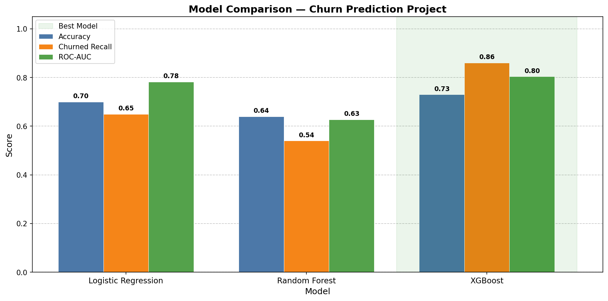

# E-Commerce Customer Churn Prediction

> Predicting customer churn using RFM feature engineering and machine learning on 1M+ real e-commerce transactions.

---

##  Problem

Customer churn is one of the most costly challenges in e-commerce. Retaining an existing customer is significantly cheaper than acquiring a new one — but only if you can identify who is at risk **before** they leave.

This project builds a machine learning pipeline that flags at-risk customers using their purchasing behaviour, giving a business the opportunity to intervene with targeted retention strategies.

---

## Dataset

- **Source:** [UCI Online Retail II Dataset](https://archive.ics.uci.edu/dataset/502/online+retail+ii)
- **Period:** December 2009 – December 2011
- **Retailer:** UK-based online gift and homeware store
- **Raw size:** 1,033,036 transactions across two sheets

| Attribute | Description |
|-----------|-------------|
| `Invoice` | Unique transaction ID |
| `StockCode` | Product code |
| `Description` | Product name |
| `Quantity` | Units purchased |
| `InvoiceDate` | Date and time of transaction |
| `Price` | Unit price (£) |
| `Customer ID` | Unique customer identifier |
| `Country` | Customer country |

---

##  Approach

### 1. Data Loading & Merging
- Combined two years of transaction data into a single dataframe
- Removed exact duplicates across both sheets

### 2. Data Cleaning
| Step | Records Remaining |
|------|-------------------|
| Raw data | 1,033,036 |
| After removing missing Customer IDs | 797,885 |
| After removing cancelled invoices | 779,495 |
| After removing invalid quantities/prices | 779,425 |
| After removing invalid StockCodes | **775,543** ✅ |

### 3. Exploratory Data Analysis
- The UK accounts for **83% of total revenue** (£14.2M vs £1.7M international)
- Created a binary `is_uk` feature to preserve both market segments in the model
- Top products are seasonal decorative homeware and gifts — key context for interpreting churn
- Monthly revenue shows a clear **peak in November 2011** (£2.16M) — strong seasonal pattern

### 4. RFM Feature Engineering
Built customer-level features based on transaction history:

| Feature | Definition |
|---------|------------|
| **Recency** | Days since last purchase |
| **Frequency** | Number of unique orders |
| **Monetary** | Total revenue generated (£) |

Applied **log transformation** to reduce skewness, then **StandardScaler** for normalisation.

### 5. Churn Labelling
- **Definition:** A customer is churned if their last purchase was more than **90 days** before the snapshot date
- Result: **59% Active · 41% Churned**
- Used stratified train/test split (80/20) to preserve class balance

### 6. Model Training & Comparison
Trained three models and compared performance across key metrics:

---

## 📊 Results



| Model | Accuracy | Churned Recall | ROC-AUC |
|-------|----------|----------------|---------|
| Logistic Regression | 0.70 | 0.65 | 0.78 |
| Random Forest | 0.64 | 0.54 | 0.63 |
| **XGBoost ✅** | **0.73** | **0.86** | **0.80** |

**XGBoost** was selected as the final model. In a churn context, **Churned Recall is the most business-critical metric** — it measures how many at-risk customers the model successfully identifies. Missing a churner (false negative) is more costly than a false alarm.

> ⚠️ **Note on data leakage:** An initial model using Recency as a feature was identified as leaking the target label. The model was retrained using only Frequency and Monetary to ensure honest, generalisable results.

---

## 💡 Key Findings

- **Seasonality matters:** Revenue spikes heavily in Q4 — churn models must account for customers who are seasonal buyers, not true churners
- **UK dominance:** 83% of revenue from a single market creates bias risk; separating UK vs international was essential
- **Recency is leaky:** When churn is defined by inactivity period, Recency directly encodes the label — excluding it is critical for model integrity
- **XGBoost outperforms on recall:** Its ability to capture churned customers (86%) makes it the most actionable model for a retention campaign

---

##  Business Recommendations

1. **Target the 41% churned segment** with re-engagement campaigns — email, discount offers, or loyalty incentives
2. **Prioritise high-Monetary churners** — customers who spent the most and went quiet represent the highest-value recovery opportunity
3. **Build seasonal context into retention logic** — customers who buy only in Q4 should not be flagged as churners in Q1
4. **Separate UK and international strategies** — the two markets behave differently and warrant distinct retention approaches
5. **Automate monthly churn scoring** — RFM features are easily refreshed from transaction data; a monthly pipeline would keep predictions current

---

## How to Run

### 1. Clone the repository
```bash
git clone https://github.com/amakobe78/ecommerce-churn-prediction.git
cd ecommerce-churn-prediction
```

### 2. Install dependencies
```bash
pip install pandas numpy scikit-learn xgboost matplotlib seaborn openpyxl joblib
```

### 3. Download the dataset
Download `online_retail_II.xlsx` from the [UCI ML Repository](https://archive.ics.uci.edu/dataset/502/online+retail+ii) and place it in the project root.

### 4. Run the notebook
```bash
jupyter notebook ecommerce_churn_project.ipynb
```

### 5. Load the saved model
```python
import joblib

model = joblib.load('churn_model_xgboost.pkl')
scaler = joblib.load('scaler.pkl')

# Example prediction (Frequency, Monetary — scaled)
sample = scaler.transform([[5, 250]])
prediction = model.predict(sample)
print("Churned" if prediction[0] == 1 else "Active")
```

---

## 🛠️ Tools & Technologies

| Tool | Purpose |
|------|---------|
| Python | Core programming language |
| Pandas & NumPy | Data manipulation |
| Scikit-learn | Preprocessing, modelling, evaluation |
| XGBoost | Final churn prediction model |
| Matplotlib & Seaborn | Data visualisation |
| Jupyter Notebook | Development environment |

---

## 👤 Author

**Stephen Amakobe**
BSc Mathematics — Kibabii University (2025)

📧 stephenamakobe8@gmail.com
🔗 [LinkedIn](www.linkedin.com/in/stephen-amakobe)
💻 [GitHub](https://github.com/amakobe78)

---

*Open to opportunities in data analytics, business intelligence, and financial services.*
Add professional README
